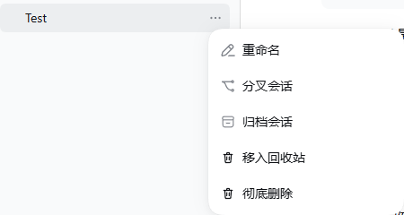
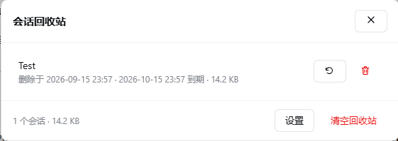
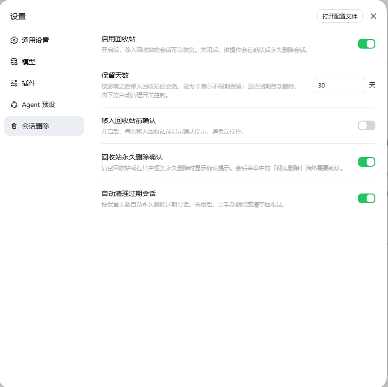

<h1 align="center">dsh-session-trash</h1>

<p align="center">为 DSH Web GUI 添加会话删除与回收站</p>

<p align="center">会话菜单一键移入回收站，在统一面板中恢复或彻底删除</p>

<p align="center">支持保留天数、删除确认与到期自动清理，设置融入原生界面</p>

<p align="center">
  
  <a href="LICENSE"></a>
  = 24" />
  
</p>

<p align="center"><strong>简体中文</strong> | <a href="README.en.md">English</a></p>

<p align="center">
  <a href="#安装">安装</a> ·
  <a href="#界面预览">界面预览</a> ·
  <a href="#开发">开发</a> ·
  <a href="CONTRIBUTING.md">贡献指南</a> ·
  <a href="CHANGELOG.md">更新记录</a>
</p>

## 功能

- **会话行菜单**：在「…」菜单中添加「移入回收站」和「彻底删除」。
- **回收站面板**：查看已删除会话，支持恢复、逐条永久删除和清空。
- **侧边栏入口**：回收站有内容时显示绿色状态点，不显示数字角标。
- **原生设置分区**：配置暂存、保留天数、确认提示和到期自动清理。
- **列表同步**：按精确会话 ID 隐藏已删除条目，并处理日志已删除但仍留在列表中的会话。

DSH 原生“删除工作区”只移除工作区登记，保留项目目录和会话日志；本插件负责会话级回收站与物理清理。删除工作区不会批量删除其中的会话，恢复时原工作区若已不存在，会话将显示在“未分组”中。

## 界面预览

### 会话菜单

在会话的「…」菜单中直接移入回收站或彻底删除。



### 回收站面板

集中查看已删除会话，并执行恢复、永久删除或清空回收站。



### 会话删除设置

在 DSH 原生设置界面中配置回收站、保留天数、确认提示和自动清理。



## 兼容性

| 项目 | 当前范围 |
| --- | --- |
| DSH | 每个版本已验证的 DSH 版本记录在对应 GitHub Release 说明中 |
| 界面 | DSH Web GUI；菜单识别依赖中文「归档会话」文案 |
| Node.js | 开发基线为 Node.js 24，本地验证版本为 `24.11.0` |
| 包管理器 | pnpm `11.19.0`，由 `packageManager` 固定 |
| 系统 | Windows 已做本地隔离验证；GitHub CI 覆盖 Windows / Linux |

菜单与工具栏使用 DOM 注入，部分身份识别依赖 React 内部结构，上游升级后需要重新验证。英文 README 不代表插件界面已完整支持英文。

## 安装

前提：已安装 DSH。推荐从项目的 GitHub Releases 页面下载对应版本的 `dsh-session-trash-<版本>.tgz`，并按同页 `SHA256SUMS.txt` 校验文件。

将下载的压缩包直接交给 DSH 安装，无需手工解压：

```powershell
dsh plugin --profile trash add "C:\Downloads\dsh-session-trash-0.1.2.tgz"
```

仅当该 profile 尚未配置 Web GUI 时，再添加 Web 插件，然后启动 DSH：

```powershell
dsh plugin --profile trash add "@deepseek-ai/dsh-web-app@0.1.5-rc.2"
dsh --profile trash --port 3080
```

打开 DSH 输出的访问地址，并按提示使用访问令牌。发布包通过 GitHub Release 提供，不发布到 npm。源码目录安装见[开发](#开发)。

## 删除与恢复

| 操作 | 行为 |
| --- | --- |
| 移入回收站 | 释放 live 运行时并阻止重新加载；日志保持原位，可以恢复 |
| 关闭暂存后点击移入回收站 | 先明确确认永久删除，再发送永久删除请求 |
| 会话菜单中的彻底删除 | 始终确认；先释放 live 运行时，再清理日志和工作区关联 |
| 清空回收站 | 逐条处理，失败项保留并显示原因 |
| 到期清理 | 启动时检查一次，此后每 30 分钟检查 |
| 恢复 | 确认日志仍在，或将完整暂存目录搬回原位置后，再移除索引 |
| 删除工作区 | 遵循 DSH 原生行为，只移除工作区登记；不会触发会话批量删除 |

删除请求携带固定意图：确认期间另一页面修改策略，不会把软删除升级成永久删除。删除当前会话时，会尽可能先切换到另一条可用会话。

如果已经开始物理删除，日志可能不完整，插件会拒绝自动恢复并保留条目供重试删除；不会提示虚假的恢复成功。回收站会话不会继续运行或被 AgentFactory 重新加载，但日志仍在磁盘上，因此不识别插件回收站索引的其他客户端仍可能把它列为冷会话。

### 默认设置

| 设置 | 默认值 |
| --- | --- |
| 暂存 | 开启 |
| 保留时间 | 30 天；`0` 表示永久保留，最大 3650 天 |
| 移入回收站前确认 | 关闭 |
| 清空 / 回收站逐条永久删除确认 | 开启 |
| 自动清理到期会话 | 开启 |

```text
$DSH_HOME/
├── sessions/                         原始会话日志
└── storages/
    ├── dsh_session_trash.json         策略、回收站索引和删除进度
    └── dsh_session_trash_files/       永久删除过程中的暂存目录
```

路径与清理间隔当前由代码设定；运行时删除策略通过设置分区修改。

## 开发

源码目录仍可用于本地安装：

```powershell
pnpm install --frozen-lockfile
pnpm run check
$pluginPath = (Get-Location).Path
dsh plugin --profile trash add "$pluginPath"
```

本地 profile、测试数据、构建目录和发布产物均不纳入版本管理。

```sh
pnpm test                  # 仅运行隔离测试，不连接真实 DSH
pnpm run test:handlers     # Host 端点行为
pnpm run test:store        # 文件操作、恢复与并发
pnpm run test:client       # 探测调度与菜单处理
pnpm run docs:check        # 文档本地链接检查
pnpm run typecheck         # 项目 TypeScript 检查，当前 checkJs=false
pnpm run build             # 生成 Host / 浏览器产物
pnpm run release:prepare   # 在 dist/ 生成 tgz、校验和与发布清单
pnpm run check             # 执行上述默认验证和构建
```

`typecheck` 尚未启用完整 JavaScript 类型检查，不能替代行为测试。真实实例测试需要单独配置，**不会由 `pnpm test` 或 CI 自动运行**。

```text
.github/                   CI、Issue 与 PR 模板
docs/                      架构、测试与截图说明
scripts/                   构建、校验和测试脚本
src/host/                  索引、策略、HTTP 端点
src/client/                菜单、回收站、设置和列表同步
lib/                       构建生成，不纳入版本管理
```

更多信息：[架构说明](docs/ARCHITECTURE.md) · [测试指南](docs/TESTING.md) · [贡献指南](CONTRIBUTING.md)。

## 卸载

```sh
dsh plugin --profile trash remove dsh-session-trash
```

卸载不会自动删除回收站数据。移除插件后，原位保留的软删除会话可能重新出现；处理索引或暂存目录前，应先确认是否还有需要恢复的数据。

## 许可证

[MIT](LICENSE)。本项目是第三方插件，与 DSH 上游项目无官方隶属关系。
